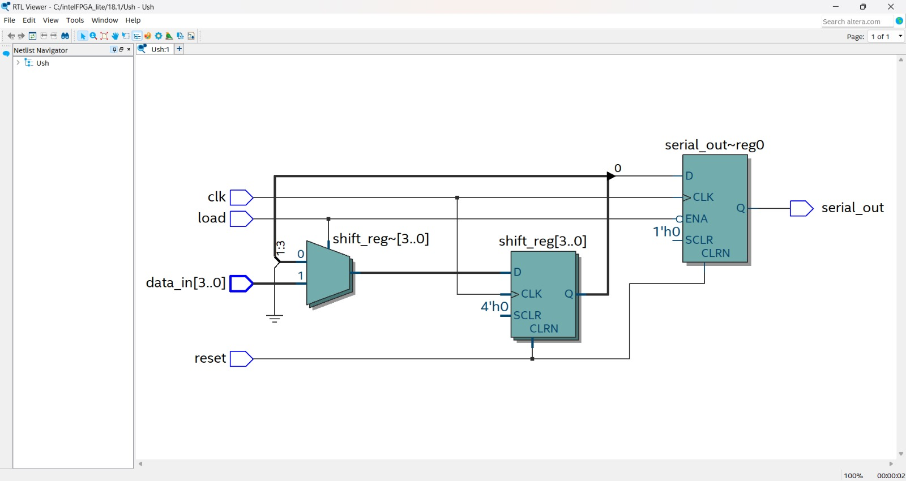

# 🔄 Universal Shift Register (4-bit) – Verilog

## 📌 Overview
This project implements a **4-bit Universal Shift Register** using Verilog HDL.  
It supports multiple operations like:

- Parallel Load  
- Shift Left  
- Shift Right  
- Hold  

The design is simulated using **ModelSim** and synthesized in **Intel Quartus Prime**.

---

## ⚙️ Features
- 4-bit input and output  
- Supports shift left & right  
- Parallel load operation  
- Reset functionality  
- RTL (Register Transfer Level) design  
- Verified using simulation waveform  

---

## 🧩 Module Description

### Inputs:
- `clk` → Clock signal  
- `reset` → Reset signal  
- `load` → Parallel load enable  
- `shift_left` → Shift left control  
- `shift_right` → Shift right control  
- `data_in[3:0]` → Parallel input  
- `serial_in` → Serial input  

### Output:
- `data_out[3:0]` → Register output  

---

## 🔁 Working
- On reset → Output becomes `0000`  
- On load → Parallel data is loaded  
- On shift_left → Bits shift left, serial_in enters LSB  
- On shift_right → Bits shift right, serial_in enters MSB  
- Otherwise → Holds value  

---

## 🧪 Simulation Waveform


👉 Shows correct shifting and loading operations  
👉 Clock-driven behavior is verified  

---

## 🧱 RTL / Netlist View



👉 Shows flip-flops and multiplexer structure  
👉 Represents hardware-level implementation  

---

## 🛠️ Tools Used
- ModelSim (Intel FPGA Starter Edition 10.5b)  
- Intel Quartus Prime Lite  
- Verilog HDL  

---

## 📂 Files Included
- `sh.v` → Universal Shift Register  
- `sh_tb.v` → Testbench  
- `waveform.png` → Simulation output  
- `netlist.png` → RTL schematic  

---

## 🚀 How to Run

1. Open ModelSim  
2. Compile:
   ```bash
   vlog sh.v sh_tb.v
